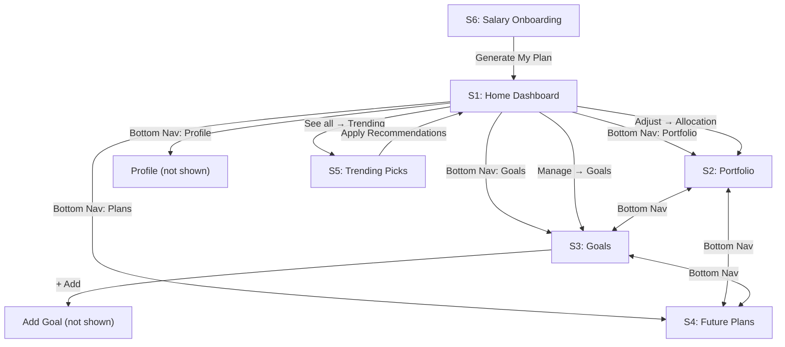

# WealthWise – Investment Advisor App — Full Design Extraction

> Complete UI/UX specification extracted from the Figma design (6 screens)

---

## 🎨 Design System

### Color Palette

| Token | Hex | Usage |
|-------|-----|-------|
| **Primary Purple** | `#6C3CE1` / `#5B2ED0` | Hero cards, CTAs, active tabs, headings |
| **Primary Purple Dark** | `#3A1A8E` | Gradient end on hero cards |
| **Accent Orange** | `#FF8C00` / `#F59E0B` | Risk bar, orange progress, gold indicators |
| **Accent Green** | `#10B981` / `#00C48C` | Positive returns, green progress bars, "Safe" badge |
| **Accent Blue** | `#3B82F6` / `#4F7DF3` | Blue progress bars, SIP category color |
| **Accent Red/Coral** | `#EF4444` / `#F87171` | High risk dot, red progress bars |
| **Accent Teal** | `#06B6D4` | Crypto, secondary indicators |
| **Accent Pink/Magenta** | `#A855F7` / `#9333EA` | Crypto category dot |
| **Text Primary** | `#1A1A2E` / `#111827` | Main headings, bold text |
| **Text Secondary** | `#6B7280` / `#9CA3AF` | Subtitles, descriptions, labels |
| **Text Green** | `#10B981` | Positive percentages (+14.2%, etc.) |
| **Text Purple** | `#6C3CE1` | "WealthWise" brand, investable amount |
| **Text Orange** | `#F59E0B` | "Moderate Risk", year labels |
| **Background** | `#F8F7FC` / `#F5F3FF` | Light lavender-grey page background |
| **Card Background** | `#FFFFFF` | Card surfaces |
| **Card Background Alt** | `#FFF9E6` / `#FEF3C7` | AI Suggestion card (light yellow) |
| **Card Background Lavender** | `#F0ECFF` / `#EDE9FE` | AI says card (light purple) |
| **Border Light** | `#E5E7EB` / `#F3F0FF` | Card borders, dividers |
| **Bottom Nav Inactive** | `#9CA3AF` | Inactive tab icons/text |

### Typography

| Element | Font | Weight | Size (approx) |
|---------|------|--------|---------------|
| Brand "WealthWise" | Inter / SF Pro | Bold (700) | 22px |
| Hero Amount (₹85,000) | Inter / SF Pro | Bold (700) | 36px |
| Section Headings | Inter / SF Pro | SemiBold (600) | 18-20px |
| Card Titles | Inter / SF Pro | SemiBold (600) | 16px |
| Body Text | Inter / SF Pro | Regular (400) | 14px |
| Subtitle/Label | Inter / SF Pro | Regular (400) | 12-13px |
| Small Caption | Inter / SF Pro | Medium (500) | 11px |
| Badge Text | Inter / SF Pro | SemiBold (600) | 10-11px |
| Bottom Nav Label | Inter / SF Pro | Medium (500) | 11px |
| CTA Button | Inter / SF Pro | SemiBold (600) | 16px |

### Spacing & Layout

| Token | Value |
|-------|-------|
| Screen width | ~390px (iPhone 14 / standard mobile) |
| Screen padding (horizontal) | 20px |
| Card padding | 16px |
| Card border radius | 16px |
| Small card border radius | 12px |
| Button border radius | 12-16px (full-round for pills) |
| Section gap | 24px |
| Card gap | 12px |
| Bottom nav height | ~64px |
| Hero card height | ~160px |

### Shadows & Effects

| Element | Shadow |
|---------|--------|
| Main card | `0 2px 8px rgba(0,0,0,0.06)` |
| Hero card | `0 4px 16px rgba(108,60,225,0.2)` |
| Bottom nav | `0 -2px 10px rgba(0,0,0,0.05)` |
| Trending card | `0 2px 8px rgba(0,0,0,0.08)` |
| Selected/Active card | `0 0 0 2px #6C3CE1` (purple border) |

---

## 📱 Screen-by-Screen Breakdown

---

### S1 – Home (Salary Setup)

> The main dashboard — first screen users see after onboarding.

#### Header
- **Left**: "WealthWise" in **bold purple** (`#6C3CE1`), ~22px
- **Right**: 🔔 Bell notification icon in **golden yellow** (`#F59E0B`)
- Background: white

#### Hero Card — Monthly Salary
- **Background**: Purple gradient (`#6C3CE1` → `#3A1A8E`), left-to-right
- **Border radius**: 16px
- **Content**:
  - Label: "Monthly Salary" — white, 13px, regular
  - Amount: "₹ 85,000" — **white, bold, ~36px**
  - Label: "Investable Amount" — white/semi-transparent, 13px
  - Amount: "₹ 25,500 → 30%" — **light purple/cyan accent**, bold, 18px
  - Bottom-right: "Edit Salary ✏️" — white text, 13px, with pen emoji

#### My Allocation Section
- **Header row**: "My Allocation" (bold, 18px) | "Adjust →" link (purple text, 14px)
- **Pill chips** (horizontally scrollable):
  - Each pill: rounded full (`border-radius: 50px`), ~70px wide, padding 8px 12px
  - Border: 2px solid, color matches category
  - Text: Category name (top, colored) + Percentage (bottom, colored, bold)
  - Categories:
    - **SIP** — Green (`#10B981`) — 35%
    - **FD** — Blue (`#3B82F6`) — 20%
    - **Gold** — Yellow/Amber (`#F59E0B`) — 15%
    - **Bonds** — Purple (`#6C3CE1`) — 15%
    - **MF** — Teal/Green (`#10B981`) — 15%

#### Risk Profile Card
- **Header**: "Risk Profile" — bold, 18px
- **Card** (white, rounded 16px, subtle shadow):
  - ⚡ emoji + "Moderate Risk" — **orange text** (`#F59E0B`), bold, 16px
  - Description: "Balanced growth • Returns 10-14% p.a." — grey, 13px
  - **Progress bar**: Full width, 6px height, rounded
    - ~70% filled with **orange** (`#F59E0B`), remaining **green** (`#10B981`)

#### Trending for You Section
- **Header row**: 🔥 "Trending for You" (bold, 18px) | "See all →" (purple link)
- **Horizontal scroll cards** (3 visible):
  - Card: white, rounded 12px, shadow, ~120px wide, ~140px tall
  - **Icon** at top: 48px circular emoji/icon (📊, 🏆, 🏦)
  - **Title**: Bold, 14px (e.g., "Mirae Asset Large Cap")
  - **Subtitle**: Grey, 12px (e.g., "Mutual Fund")
  - **Returns**: Green, bold, 12px (e.g., "▲ 14.2%")

#### Goals Section
- **Header row**: 🎯 "Goals" (bold, 18px) | "Manage →" (purple link)
- **Horizontal mini-cards** (3 visible):
  - Icon (🏠, 🎓, ✈️) + label below
  - Progress bar underneath (colored: blue, blue, blue)
  - Labels: "Home", "Child Ed", "Travel"

#### Bottom Navigation Bar
- 5 tabs, evenly spaced
- **Active tab**: Purple icon + purple text + blue underline bar (3px)
- **Inactive tabs**: Grey icons + grey text
- Tabs (left to right):
  1. 🏠 **Home** (active)
  2. 📊 **Portfolio**
  3. 🎯 **Goals**
  4. 📅 **Plans** (calendar icon with "17")
  5. 👤 **Profile**

---

### S2 – Portfolio

#### Header
- "← Portfolio" — back arrow + bold title, 20px
- Right: "June 2026" — grey text, 14px

#### Donut Chart
- **Center**: "₹25,500" bold + "Invested" subtitle below
- **Ring**: Segmented donut chart showing allocation
- **Legend** (right side, vertical list):
  - ● SIP / MF — 35% (purple dot)
  - ● FD — 20% (green dot)
  - ● Gold — 15% (amber dot)
  - ● Bonds — 15% (blue dot)
  - ● Silver — 10% (coral/red dot)
  - ● Crypto — 5% (magenta dot)

#### Investment Categories
- **Section title**: "Investment Categories" — bold, 18px
- **List of cards** (6 items, vertically stacked):

Each card:
- White background, rounded 12px, full-width
- **Left**: 48px circular icon with emoji
- **Center column**:
  - Title: bold, 16px (e.g., "SIP")
  - Subtitle: grey, 13px (e.g., "5 Active SIPs")
  - Progress bar below: colored, 4px height, rounded, ~40-60% filled
- **Right column**:
  - Return %: green bold, 14px (e.g., "+14.2%")
  - Amount: grey, 14px (e.g., "₹8,925")

| # | Category | Subtitle | Return | Amount | Bar Color |
|---|----------|----------|--------|--------|-----------|
| 1 | SIP | 5 Active SIPs | +14.2% | ₹8,925 | Blue |
| 2 | Fixed Deposit | 3 FDs Active | +7.5% | ₹5,100 | Green |
| 3 | Gold | SGB + ETF | +11.8% | ₹3,825 | Amber |
| 4 | Bonds | Govt + Corp | +8.2% | ₹3,825 | Yellow |
| 5 | Silver | ETF via Zerodha | +9.1% | ₹2,550 | Red/Coral |
| 6 | Crypto | BTC + ETH | +22.4% | ₹1,275 | Blue |

#### Bottom Nav
- Same as S1, with **Portfolio** tab active

---

### S3 – Goals

#### Header
- "← My Goals" — back arrow + bold title, 20px
- Right: **"+ Add"** — purple bold text, 16px

#### Hero Card — Goals Summary
- Purple gradient (same as S1 hero)
- Content:
  - "3 Active Goals" — white, 13px
  - "₹12,750 / mo saving" — **white, bold, ~32px**
  - "On track to reach 2 goals by 2028 🚀" — white, 13px

#### Goal Cards (4 items, vertically stacked)
Each card:
- White, rounded 16px, padding 16px
- **Left**: 48px emoji icon
- **Content**:
  - Title: bold, 16px
  - Subtitle: grey, 13px (e.g., "₹22,50,000 of ₹50,00,000")
  - **Progress bar**: full-width, 6px, colored, rounded
- **Right side**:
  - Percentage: colored bold, 16px
  - Time remaining: grey, 12px

| # | Goal | Progress | % | Timeline | Bar Color |
|---|------|----------|---|----------|-----------|
| 1 | Buy Home 🏠 | ₹22,50,000 of ₹50,00,000 | 45% | ~4 yrs left | Blue |
| 2 | Child's Education 📚 | ₹3,30,000 of ₹15,00,000 | 22% | ~7 yrs left | Blue |
| 3 | World Tour ✈️ | ₹2,01,000 of ₹3,00,000 | 67% | ~8 months | Green/Teal |
| 4 | Car Upgrade 🚗 | ₹80,000 of ₹8,00,000 | 10% | ~3 yrs left | Orange |

#### AI Suggestion Card
- **Background**: Light yellow/cream (`#FEF3C7` / `#FFF9E6`)
- Rounded 16px
- 💡 "AI Suggestion" — **green bold**, 14px
- Body: "Increase Home goal SIP by ₹1,000/mo to achieve goal 6 months earlier." — grey, 13px

#### Bottom Nav
- **Goals** tab active

---

### S4 – Future Plans & Decision Maker

#### Header
- "← Future Plans" — back arrow + bold title, 20px

#### Hero Card — Projected Wealth
- Purple gradient (same style)
- Content:
  - "Projected Wealth (10 yrs)" — white, 13px
  - "₹1,22,40,000" — **white, bold, ~32px**
  - "at 12% CAGR with ₹25,500/mo SIP" — white, 13px
  - **Bar chart**: 6 bars (Y2, Y4, Y6, Y8, Y10, Y12) — light purple/white bars, increasing height

#### Milestones Section
- 🏛️ "Milestones" — bold, 18px
- **Timeline list** (5 items, vertically):

| Year | Milestone | Status |
|------|-----------|--------|
| 2027 | Emergency Fund Complete | ✅ Green check (completed) — filled green circle |
| 2028 | ₹10L Corpus Target | ○ Empty circle (pending) |
| 2030 | Home Down Payment Ready | ○ Empty circle |
| 2033 | Child Education Fund | ○ Empty circle |
| 2036 | Retirement Starter Pack | ○ Empty circle |

- Year labels: **green bold** (`#10B981`), 13px
- Milestone text: dark, 15px
- Divider lines between items

#### AI Decision Maker Section
- 🤖 "AI Decision Maker" — bold, 18px
- **Question card**:
  - "Should I increase SIP this month?" — bold, 16px
  - Description: grey, 13px
- **Option cards** (2):
  1. ✅ **"Yes — Increase by ₹2,000"** — green-bordered card, selected state
     - Subtitle: "Market dip = buying opportunity" — green, 12px
     - Border: 2px green, light green bg
  2. ⏸️ **"Hold — Keep current SIP"** — neutral card
     - Subtitle: "If expenses rise this month" — grey, 12px

#### Bottom Nav
- **Plans** tab active

---

### S5 – Trending Picks

#### Header
- "← Trending Picks" — back arrow + bold title, 20px

#### Risk Level Filter
- "Risk Level" — bold label, 14px
- **Segmented control** (3 options):
  - "Low" | **"Moderate"** (active — purple bg, white text) | "High"
  - Rounded full pills, ~100px each
  - Inactive: grey bg, dark text
  - Active: purple bg (`#6C3CE1`), white text

#### Top 3 List
- 🔥 "Top 3 for Moderate Risk" — bold, 18px
- **Numbered cards** (3 items):

| # | Fund | Details | Return | Min | Badge | Action |
|---|------|---------|--------|-----|-------|--------|
| 1 | Mirae Asset Large Cap Fund | 5★ • Equity – Large Cap | 14.2% CAGR | ₹500/mo | **TRENDING** (purple badge) | ✓ Added (green) |
| 2 | SGB Gold Bond 2026 | Sovereign Backed • 2.5% + Gold | 11.8% CAGR | ₹2,000 min | **LOW RISK** (orange badge) | + Add (outline btn) |
| 3 | HDFC Bank FD — 500 Days | Secured • DICGC Insured | 7.5% p.a. | ₹10,000 min | **SAFE** (green badge) | + Add (outline btn) |

Card #1 has a **purple dashed border** (selected/added state)

- **Number circles**: Purple bg, white text, 24px circle
- **Return text**: Green bold
- **Badges**: Colored pill badges (TRENDING=purple, LOW RISK=orange, SAFE=green)
- **+ Add button**: Purple outlined, rounded, small

#### AI Says Card
- Light purple/lavender bg (`#EDE9FE`)
- 🤖 "AI says:" — purple bold, 14px
- Body text: "For your ₹25,500 investable amount at Moderate risk, allocate 35% to SIP + 15% Gold as a hedge."

#### CTA Button
- **Full-width button**: Purple gradient bg (`#6C3CE1` → `#5B2ED0`)
- "Apply Recommendations →" — white, bold, 16px
- Rounded 12px, height ~52px
- Subtle shadow

---

### S6 – Salary Onboarding

#### Content (centered layout)
- 👋 Waving hand emoji — large, ~48px
- **"Welcome, Vansh!"** — bold, ~32px, dark text
- "Let's set up your personal investment dashboard in 2 minutes." — grey, 14px

#### Form Fields
1. **Monthly Salary (₹)** — label, 14px
   - Input field: "₹ 85,000" — large text, 20px
   - Border: light grey, rounded 12px
   - Height: ~52px

2. **Save % to Invest** — label, 14px
   - **Slider**: Track with blue fill + grey remaining
   - **Thumb**: Blue circle, 20px
   - **Display**: "30%" — large purple bold, ~32px
   - Subtitle: "of monthly salary = ₹25,500" — grey, 13px

3. **Risk Appetite** — label, 14px
   - **3 pill buttons** (horizontal):
     - 🟢 Low — grey border, unselected
     - 🟡 **Moderate** — **orange border, selected state** (orange bg tint)
     - 🔴 High — grey border, unselected
   - Each pill: ~100px, rounded full, 40px height

#### CTA Button
- Full-width: **"Generate My Plan →"**
- **Dark purple/navy bg** (`#2D1B69` or `#1E1357`)
- White text, bold, 16px
- Rounded 12px, ~52px height

#### Footer
- "Your data is private and never shared. 🔒" — grey, 12px, centered

---

## 🧩 Component Inventory

### Reusable Components

| Component | Used In | Description |
|-----------|---------|-------------|
| **Hero Gradient Card** | S1, S3, S4 | Purple gradient card with white text, 16px radius |
| **Bottom Navigation Bar** | S1-S5 | 5-tab bar with icons, labels, active indicator |
| **Section Header** | S1-S5 | Title + action link ("See all →", "Adjust →") |
| **Category Pill Chip** | S1 | Colored border pill with label + percentage |
| **Investment Category Card** | S2 | Icon + title + subtitle + progress bar + return + amount |
| **Goal Progress Card** | S3 | Icon + title + amount/target + progress bar + % + timeline |
| **Trending Fund Card** | S1, S5 | Icon + title + subtitle + return indicator |
| **AI Suggestion Card** | S3, S4, S5 | Light-colored card with AI icon + message |
| **Milestone Item** | S4 | Year badge + text + status circle/check |
| **Decision Option Card** | S4 | Selectable card with icon + title + subtitle |
| **Risk Level Segmented Control** | S5, S6 | 3-option pill selector (Low/Moderate/High) |
| **Form Input** | S6 | Label + bordered input field |
| **Slider** | S6 | Track + thumb + value display |
| **Primary CTA Button** | S5, S6 | Full-width, gradient/solid purple, white text |
| **Badge/Tag** | S5 | Colored pill (TRENDING, LOW RISK, SAFE) |
| **Donut Chart** | S2 | Segmented ring with center text + legend |
| **Progress Bar** | S1-S4 | Thin colored bar showing completion |
| **Mini Bar Chart** | S4 | Vertical bars showing projected growth |

---

## 🔄 Navigation Flow

---

## 🎯 Key Design Patterns

1. **Purple-first brand identity** — Primary purple (`#6C3CE1`) is used everywhere: brand name, hero cards, CTAs, active states, links
2. **Gradient hero cards** — Consistent purple gradient cards at the top of most screens for key financial summaries
3. **Card-based layout** — All content organized in white rounded cards with subtle shadows
4. **Emoji as icons** — Extensively uses emoji (🏠🎓✈️🚗🔥💡🤖) instead of custom icons for a friendly, approachable feel
5. **Color-coded categories** — Each investment type has a distinct color (SIP=blue, FD=green, Gold=amber, etc.)
6. **Progress visualization** — Thin colored progress bars appear in nearly every card
7. **AI integration** — AI suggestions appear as distinctly-colored cards (yellow/lavender) across multiple screens
8. **Consistent spacing** — 20px page padding, 16px card padding, 12px gaps
9. **Light background** — Subtle lavender-tinted grey (`#F8F7FC`) creates depth without being harsh
10. **Indian Rupee (₹) formatting** — Indian number system (lakhs/crores) with comma separators
